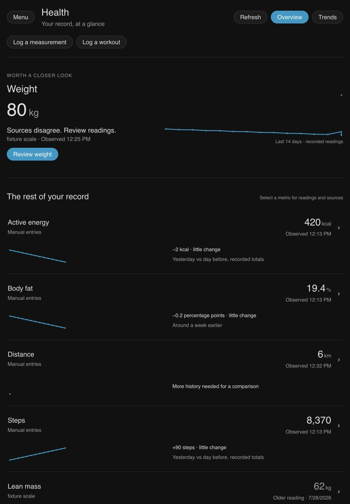
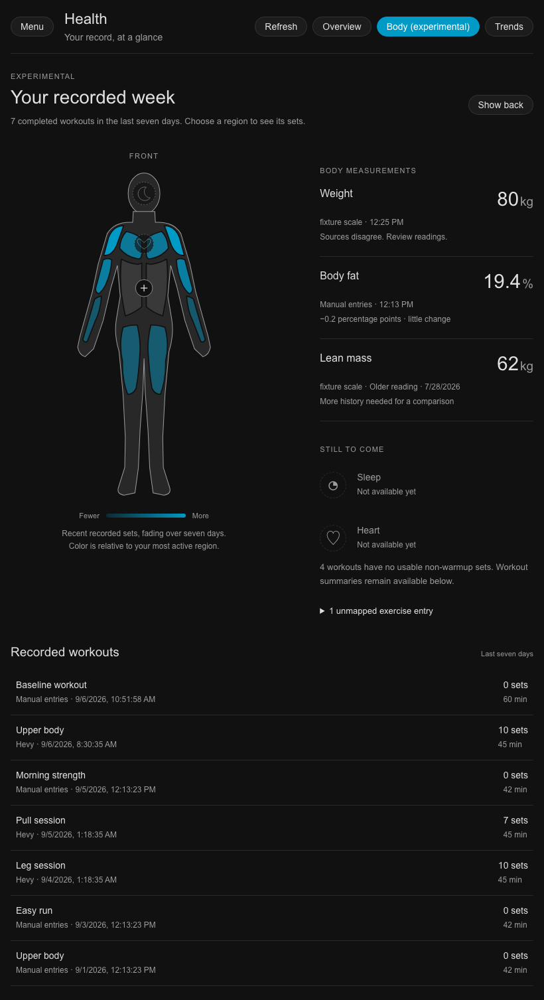

# Health Assistant for Home Assistant

[](https://github.com/DisplacedForest/ha-health-assistant/actions/workflows/ci.yml)
[](https://github.com/DisplacedForest/ha-health-assistant/releases)
[](https://github.com/DisplacedForest/ha-health-assistant/stargazers)
[](https://github.com/DisplacedForest/ha-health-assistant/commits/main)
[](LICENSE)
[](https://www.home-assistant.io/)
[](https://buymeacoffee.com/o7triud67l)

Health Assistant keeps body measurements, daily activity counters and workouts in a local SQLite history, with a dedicated Health panel in Home Assistant. It reads existing sensors and supported integrations, normalizes units, and keeps the source records behind each reading.

**0.2.0 requires Home Assistant 2026.8.0 or later.** Install it manually or as a custom HACS repository. It isn't in the HACS default store yet.

## Why

A scale and a fitness service can report the same weigh-in with different units or slightly different times. Recorder keeps sensor states, but it doesn't decide whether those reports describe one measurement. Health Assistant keeps both source claims, reconciles matching reports and lets you inspect disagreements.

The health database has its own lifecycle, separate from Recorder retention. Removing an integration or renaming a sensor doesn't erase its recorded history. Summary sensors work with normal Home Assistant automations; the Health panel provides trends, source detail and correction controls.

This release records weight, body fat, lean mass, steps, distance, active energy and workouts. It also offers optional room temperature, humidity and CO2 history. Sleep, recovery metrics, custom health events and environmental correlations are still future work. Use one person's sources per installation; multi-person attribution isn't available yet.

## Incorrect readings

An excluded reading stays in your local history and keeps its source information, but it no longer contributes to current values, daily activity or charts. You can restore it later. Exclusion is not deletion or privacy erasure.

Exclusion follows the source records behind a measurement. Replaying those records or changing source priority does not bring the reading back. A new source report that merges into the same measurement inherits its exclusion. A distinct reading remains visible. Matching still depends on the source identity, timestamp and metric's reconciliation rules; a source that presents a bad reading as a different measurement may need another exclusion.

Open a metric in the Health panel, choose a reading, and select **Exclude reading**. To bring one back, turn on **Excluded only**, open the reading, and select **Restore reading**. These controls require a Home Assistant administrator. Full value editing and permanent erasure are not available in this release.

The authenticated WebSocket commands `health_assistant/observations` and `health_assistant/observation_exclusion` expose the same behavior for tools. Listing supports metric and excluded-state filters, at most 100 records, and a `before_id` cursor. The change command accepts `observation_id` and an `excluded` boolean.

## Privacy

Privacy by default. Health Assistant has no cloud component and requires no external service to run.

What is stored, and where:

- All health data lives in a single SQLite database at `.storage/health_assistant/health.sqlite` inside your Home Assistant config directory.
- Each record holds the metric, value, unit, timestamp, person identifier, and provenance (which sensor or action produced it). Workouts additionally hold type, optional title, start, end, energy, and distance. Source claims, priorities, exclusions, workout exercise detail and environmental history live in that same file.
- Backups you create land beside it under `.storage/health_assistant/backups/`.
- Your entity-to-metric mappings live in the config entry options, in HA's normal storage.

What Health Assistant never does:

- Health Assistant makes no outbound connections and has no telemetry. Your installed source integrations may communicate with their vendors under their own settings. Exports and backups stay on your disk until you move or share them.
- Diagnostics downloads include record counts, schema version, provider keys and capabilities, mapping counts, and database health. Provider status includes whether it is degraded and when an operation last succeeded. That timestamp is not the time of the latest measurement. Status starts fresh when the integration reloads. A previous failure appears as `provider_error`, even after recovery; the degraded flag tells you whether the provider has recovered. Raw errors, measurements, workout titles, provider cursors, and provenance payloads are excluded.
- Uninstalling the integration never deletes your database.

## Which source wins

When more than one source reports the same metric, one documented rule decides the canonical value, and every surface (sensors, the panel, store queries) uses it.

- Each metric has a source priority order. It starts from sensible defaults (sources are added to the order as they register, in setup order) and you can reorder it; the order lives in the local database alongside your data.
- Two providers reporting the same physical measurement (inside a per-metric time window and value tolerance: for body measurements, 2 minutes and 0.5 kg or 1 percent, whichever is looser) collapse into one canonical observation that keeps both provenances. The highest-priority source supplies the value.
- Readings inside the time window but outside the value tolerance remain separate: both records stay, both are flagged as possible duplicates, and the current value comes from the highest-priority source among the records contesting the newest timestamp. Ties break by newest observation, then stable record id.
- Outside the contested window, normal time-series behavior applies: the newest observation is the current value regardless of priority.
- Reordering priority never deletes anything. Alternate claims are retained and the canonical values re-derive from them.

## Architecture

The integration is a HACS custom integration with the domain `health_assistant`:

```
custom_components/health_assistant/   backend: store, ingestion, providers, entities
custom_components/health_assistant/frontend/   the dedicated Health panel
```

Backend and frontend are kept behind a deliberate boundary so the panel can evolve without coupling persistence to UI.

Core concepts:

- **Canonical store**: a local SQLite database holding normalized health observations. It lives at `.storage/health_assistant/health.sqlite` inside your Home Assistant config directory, owned entirely by the integration: Recorder never stores it, and unloading or removing the integration never deletes it.
- **Observations**: typed records (body measurements, activity, workouts, and later sleep and recovery) with units, timestamps, and provenance.
- **Source claims and reconciliation**: every incoming record is kept as a source claim, and canonical observations are derived from claims. When two providers report the same physical measurement close together in time (a weigh-in arriving both from the scale integration and a health platform bridge), the claims merge under one canonical observation carrying both provenances; the merge windows are conservative, per metric class, and same-provider records never merge. Near-misses that fall inside a wider suspicious window are never merged silently: both records stay separate and carry a possible-duplicate flag you can see in the panel data. No claim is ever deleted by reconciliation, so the process is replayable.
- **Providers**: adapters for manual actions, mapped HA sensors, curated Withings and Fitbit sensors, and Hevy workout summaries. The provider contract is internal.
- **Entities**: summary sensors derived from the store. Custom health events and triggers are not part of this release.

## Roadmap

- **0.1.0 Foundation**: canonical store, body/activity/workout observations, HA sensor and manual ingestion, basic entities, first Health panel.
- **0.2.0 Sources & History**: source setup, Hevy capture, reconciliation, exclusions, portable history, room capture, Overview and experimental Body.
- **0.3.0 Sleep & Recovery**: sleep sessions, resting HR, HRV, recovery metrics, Apple Health and Health Connect bridge support.
- **0.4.0 Trends & Context**: longitudinal charts, environmental correlations, comparisons, health timeline.
- **0.5.0 Automation & Platform**: health events, richer automation primitives, provider capability contracts.
- **1.0.0**: stable local health platform with polished frontend and stable provider contracts.

## Environmental history

Requires Home Assistant 2026.8.0 or later. Upgrade Home Assistant before installing this build. The integration refuses setup on older versions.

Open Settings, Devices & services, Health Assistant, Configure and select **Configure environmental capture**. Add an existing temperature, relative humidity or CO2 sensor. You can capture up to 12 measurements at once. Temperature accepts °C, °F or K and is stored in °C; humidity uses percent and CO2 uses ppm. Noise and air-quality index sensors are not supported yet.

The area comes from the entity, then its device, unless you choose an override. A sensor needs an area before capture starts. Changing areas starts a new history segment and keeps earlier records in their original room. To change a mapping, stop it and add it again. Stopping capture keeps its history. A room assignment does not establish who was there or where someone slept.

History starts with the next fresh sensor report. Five-minute records store the average weighted by covered time, extrema and sample counts. A repeated report of the same value extends coverage. Reading an old HA state does not. A value is held for at most 15 minutes after a report; unavailable sensors, restarts and longer gaps leave missing coverage. This describes what HA reported, not a guarantee that a physical sensor was working. There are no environmental charts or health correlations in this release.

Five-minute records are kept for 90 days, then combined into hourly records until they reach two years old. Older records are removed. Hourly history retains the total covered time but loses the exact timing of gaps within the hour. Maintenance runs after startup and daily. Diagnostics show its last success, record counts and sanitized failure status. A failed database write pauses capture while pending records are retried; that interval stays uncovered. An orderly unload saves the partial record. A crash can lose the open five-minute record.

Twelve continuously recorded streams budget about 79.31 MB after two years, plus fixed database overhead and maintenance delay. Area changes create additional stream revisions, so the number of active sensors alone does not describe storage use. The registry holds at most 256 active or historical streams; setup reports an error at that limit. SQLite reuses deleted pages, so the file may keep its previous size. Backups need additional space.

Environmental records live locally in the same database as health history. Room names, source IDs and timing can be sensitive even without health values. SQLite backups and portable history archives include retained environmental records, coverage and area metadata. A database backup restores the whole store; a portable import merges its history.

This build moves the database to schema 9. Older integration builds cannot open it. Before upgrading, create a backup. To return to an older build, restore a backup that matches it. Migration stops if a custom legacy provider already uses the reserved `bridge:<UUID>` namespace; it does not adopt that history.

## Native phone bridge

The native bridge receiver stores ordered corrections, deletions and source identity for compatible phone producers. It supports scalar values, workouts, sleep and recovery records. Apple Health and Health Connect client routes still need qualification; installing this receiver doesn't connect a phone by itself.

An administrator enrolls the source and explicitly rearms it after every integration setup, reload or backup restore. Capture stays paused when the producer's saved state doesn't match. Portable imports preserve history without granting capture permission. Environmental streams and bridge sources share the same 256-slot registry. See [native bridge setup and protocol](docs/mobile-bridge.md) for enrollment, payloads, retries, rearm and current limits.

## Getting data in

**Choose a source.** Install and sign in to Withings or Fitbit through Home Assistant first. Health Assistant offers the accounts it finds during setup and under Settings, Devices & services, Health Assistant, Configure. Choose an account for each metric and confirm that new accounts belong to the person in this health history. No passwords or vendor sign-ins pass through Health Assistant.

| Source | Automatic mapping | Limits |
| --- | --- | --- |
| Withings | Weight, body fat percentage, lean mass, steps, distance | Uses the standard Home Assistant integration's registered sensor identifiers. Active energy is not mapped because its advertised calorie unit needs a verified conversion. |
| Fitbit | Weight, body fat percentage, steps, distance | Uses the standard Home Assistant integration. Tracker-only variants and calorie sensors are not mapped automatically. |
| Hevy Tracker | Latest completed workout and its available exercise sets | Choose the workout account explicitly. No history import, live sessions, or body-measurement export. |
| Garmin Connect | Detection only for the `garmin_connect` integration domain | Use manual entity mapping. No sensor contract has been verified yet. |
| Apple Health / Health Connect bridges | Detection only for `apple_health` and `health_connect` integration domains | Other bridges use manual mapping. There is no shared bridge entity contract yet. |
| Other registered providers | Declared metric coverage appears in the same options chooser | The adapter must be registered and support importing that metric. |

The source list shows the actual entities and warns about missing, disabled, unavailable, ambiguous, or incompatible sensors. Only ready sensors can be selected. Renamed entities are matched by their registry identity, so changing an entity ID does not break a curated mapping. Curated sources require an explicit, compatible unit on every reading.

Choosing a source puts it first in that metric's existing priority order. The database holds that order; there is no separate setup preference to keep in sync. Choosing a different source keeps existing mappings active. Choosing a different account from the same integration replaces that integration's mappings and keeps its recorded history. Choose accounts for one person only.

Withings and Fitbit readings retain their source names in the stored records, summary sensor attributes, and panel data. Existing manual mappings keep their generic entity provenance. Capture starts with the sensor's current state and continues on future updates; this does not import the vendor's past history. A source that becomes unavailable later keeps its mapping and resumes when valid readings return.

**Capture Hevy workouts.** Install Hevy Tracker in Home Assistant, then choose its account under **Workout source**. Workout capture is separate from metric priorities. Health Assistant reads the integration's public latest-workout summary and checks for changes every minute and when that sensor updates. It uses the reported start time and rounded duration, keeps exercise names and optional notes, and converts set weights and distances to kilograms and meters. No API key or private coordinator data is read.

Capture starts with the completed workout currently exposed by Hevy Tracker. Subsequent workouts accumulate locally; there is no history import or live-session capture. Repeated syncs, restarts, entity renames, and changes to display units do not create another copy. When a public workout ID is present, it identifies the record. Today's summary has no ID, so identity uses the account, title, and workout times. Changing that title or those times can create another record; the summary does not provide enough information to reliably match such edits.

An unavailable or invalid summary marks only the Hevy source as degraded and retries on later updates. Disabling automatic workout capture keeps recorded workouts and leaves manual workout entry available. There is no body-measurement export, even if an installed version registers a similarly named service.

Exercise detail is limited to 100 exercises, 100 sets per exercise, 1,000 sets overall, 1,000 characters per note, and 256 KiB of stored detail. Durations must be finite, nonnegative, and no longer than seven days. Invalid dates, numbers, units, or payloads are rejected instead of partially importing a workout. These checks apply to the exposed summary; they cannot recover detail the source has rounded or omitted.

**Map sensors manually.** Use this for templates, unknown integrations, or metrics without an automatic map. Select **Also edit manual entity mappings** in the source chooser. If no known sources are installed, Configure opens the manual form directly. Map sensors to weight, body fat percentage, lean mass, steps, distance, or active energy. State changes are converted from the sensor's unit, or your configured unit system when a manual sensor has no unit. Unknown, unavailable, or non-numeric states are never stored. Mapping changes apply immediately.

**Manual actions.** Three actions write records directly, including backfill with explicit timestamps:

```yaml
action: health_assistant.add_observation
data:
  metric: weight
  value: 180.2
  unit: lb
  observed_at: "2024-11-02T07:30:00"
  source: old spreadsheet
```

```yaml
action: health_assistant.add_workout
data:
  workout_type: running
  title: Morning run
  start: "2026-08-20T07:00:00"
  end: "2026-08-20T07:45:00"
  distance: 5
  distance_unit: km
  energy_kcal: 400
```

`health_assistant.add_body_measurement` records weight, body fat, and lean mass sharing one timestamp. Passing an `external_id` makes repeated calls idempotent, so re-running a backfill script never duplicates records.

## The Health panel



Configuring Health Assistant adds a Health entry to the sidebar, no manual resource registration needed. The panel is a real application view over the canonical store, served entirely from your instance and fully functional offline:

- **Overview**: leads with a change in your record, then keeps quieter metrics in compact rows. Each reading has a recent trend, its source and observation time. Metrics without data stay collapsed. The workout strip covers the last seven days.
- **Body (experimental)**: a fixed front and back figure shows recent recorded sets by muscle region. Open a region for its workouts, or a body measurement for the same readings and source detail as Overview.
- **Trends**: weight, body fat, lean mass, steps, distance, and active energy over 7, 30, or 90 days, drawn as lightweight SVG charts.
- Values display in your configured unit system; empty states point you at entity mapping and the manual actions.
- Manual entry times use your browser's local timezone and are sent with an explicit offset-equivalent UTC timestamp.

Data reaches the panel through a dedicated WebSocket API with bounded queries and server-side downsampling. The frontend never touches the database, and the backend never renders.

Select a metric to inspect its readings. The detail view shows the claim supplying the selected record, the other retained claims, and nearby readings that may explain a disagreement. It also provides exclusion and restoration controls. The Sources disclosure shows current source health and the last successful operation, which is separate from the age of a measurement. The view refreshes every minute while open, or immediately when you press Refresh.

Comparisons have deliberately narrow meanings:

- Weight, body fat and lean mass compare the latest reading with the closest reading to seven days earlier, within a five-to-nine-day window. Different sources or a source conflict suppress the delta.
- Steps, distance and active energy compare yesterday's recorded maximum with the day before. These are recorded counter totals, not proof that a tracker covered the full day. Today's partial count is never compared with a completed day. Local calendar boundaries follow Home Assistant's timezone.
- Missing comparison readings produce no delta. Chart lines break at source changes. Body fat differences are percentage points.
- Body measurements older than 14 days and activity readings older than 36 hours are marked as older readings. These are display defaults, not recommendations about measurement frequency.

Source conflicts and source changes come first among fresh readings. Other fresh changes sort ahead of quiet metrics when they reach 0.5 kg for weight or lean mass, 0.5 percentage points for body fat, 1,000 steps, 1 km, or 100 kcal. Larger changes relative to those thresholds come first; ties and quiet metrics use a stable metric order. Stale readings follow fresh ones. These thresholds organize the display and say nothing about medical significance.

The Overview carries at most 120 chart points per metric, eight recent workouts and 32 source statuses. Reading detail carries at most 50 claims and 25 nearby readings; history loads in pages of 20. Arbitrary provider metadata is not copied into the panel payload.

### Experimental Body view



Body is opt-in. Overview opens first on a new browser, and your explicit view choice is remembered locally for your Home Assistant user. The figure has fixed proportions; it doesn't reshape itself from your measurements.

Color comes from usable non-warmup sets recorded in the last seven days. Each set fades with age, and the most active region gets the strongest shade. These are recorded-set counts, not recovery estimates. Workout detail shows reps, weights and source identity. Sleep and heart regions are marked "Not available yet."

Exercise names use a small curated map. Unknown names are listed, and workouts without usable sets remain visible. Sources that only provide a workout summary won't produce muscle color. Body shows up to 100 workouts and marks incomplete or oversized detail. See [Body view](docs/body-view.md) for the exact calculation, data limits and how to add exercise aliases.

## Entities

All entities live under a single Health Assistant device, read from the canonical store, and show unknown until data exists. Display units follow your Home Assistant unit system; stored values stay canonical.

| Entity | Meaning | Units | Updates |
| --- | --- | --- | --- |
| `sensor.health_assistant_current_weight` | Latest weight reading | kg, shown as lb on US systems | On ingestion |
| `sensor.health_assistant_current_body_fat` | Latest body fat reading | % | On ingestion |
| `sensor.health_assistant_steps_today` | Highest step count recorded today | steps | On ingestion |
| `sensor.health_assistant_active_energy_today` | Highest active energy recorded today | kcal | On ingestion |
| `sensor.health_assistant_latest_workout` | Most recent workout title or type, with start, end, and duration attributes | text | On ingestion |
| `sensor.health_assistant_workouts_last_7_days` | Workouts in the trailing 7 days | count | On ingestion |

Each measurement sensor carries `observed_at`, `provider`, and `source` attributes identifying exactly where its current value came from. Attributes never contain history; trends belong to the panel.

## Installation

Use Home Assistant 2026.8.0 or later. Health Assistant is available as a custom HACS repository or a manual install. Default-store inclusion still needs the Home Assistant branding requirement and external review.

**As a custom HACS repository (recommended):**

1. In HACS, open the three-dot menu and pick Custom repositories.
2. Add `https://github.com/DisplacedForest/ha-health-assistant` with type Integration.
3. Find Health Assistant in HACS, install it, and restart Home Assistant.

**Manually:**

1. Download the latest release from the [releases page](https://github.com/DisplacedForest/ha-health-assistant/releases).
2. Copy `custom_components/health_assistant` into your config directory's `custom_components` folder.
3. Restart Home Assistant.

Either way, finish by adding the integration: Settings, then Devices & services, then Add integration, then Health Assistant.

## Portable history

Use **Export health history** in Developer tools, Actions to save your health history in a portable archive:

```yaml
action: health_assistant.export_history
data:
  path: health-exports/history.tar.gz
```

The path is inside your Home Assistant config directory. The action creates parent folders and refuses to overwrite an existing file. Only administrators can export or import. Archives contain sensitive health history, workout details and room metadata, so keep them somewhere private. They are compressed, not encrypted.

To move history to another installation, copy the archive into that installation's config directory and run **Import health history**:

```yaml
action: health_assistant.import_history
data:
  path: health-exports/history.tar.gz
  dry_run: true
```

The response lists record counts, date coverage, sources and expected changes. Dry run is on by default. Check the response, create a database backup, then call the same action with `dry_run: false` to merge the history. Repeating the same import won't duplicate it. If an import stops partway through, retry the same archive. Priorities and readings commit together; completed workout, environmental, sleep and recovery batches stay committed. Large health imports can delay incoming readings while that transaction finishes. Writes that arrive during an import can make the applied counts differ from the preview.

Imports include source priorities and can change which source supplies a current value. Excluded readings stay excluded, including readings excluded on the destination. A newer local version of the same source record wins over an older archive. Environmental history retains its source and area identities; imports do not configure live sensors or restore provider accounts. Set those up separately. Room metadata describes sensor context, not your personal exposure.

The archive contains canonical observations and their source claims, workouts with stored exercise sets, provenance, exclusions, priorities, environmental streams, retained buckets and revisioned sleep sessions and recovery observations. Format 1 archives from 0.2 and format 2/schema 7 archives remain importable and leave later domains unchanged. It does not contain integration credentials, provider sync state or Home Assistant configuration. Old environmental detail that has already been rolled into hourly history is not recreated by replaying an older archive. Normal retention still applies after import.

See the [archive format and merge rules](docs/interchange-format.md) for fields, limits and recovery details. Use a SQLite backup below to restore the health store exactly, or a Home Assistant backup to restore the configuration as well.

## Upgrading from 0.1

Create a database backup before installing 0.2.0, and upgrade Home Assistant first if it is older than 2026.8.0. Install the new integration files and restart Home Assistant. Existing readings, workouts and manual mappings are retained; the database migrates to schema 6 on setup. Open Health Assistant's Configure dialog to choose any new sources or room sensors.

An older integration build cannot read the upgraded database. To roll back, stop Home Assistant, restore the older integration files and their matching database backup, then start it again. Replacing only the integration files is not a rollback.

## Backup and restore

Keep a database backup before upgrading, importing history or changing an existing store.

**Home Assistant backups** that include your Home Assistant configuration include the database under `.storage`. Health Assistant checkpoints it when a native backup starts.

**On-demand backups** come from the `health_assistant.create_backup` action. It uses SQLite's online backup API, so the copy is consistent even while data is being ingested, and writes a timestamped file under `.storage/health_assistant/backups/`. Call it from Developer tools, an automation, or a schedule. The action returns the path it wrote.

**To restore:**

1. Stop Home Assistant (or unload the Health Assistant config entry from Settings, then Devices & services).
2. In `.storage/health_assistant/`, delete `health.sqlite-wal` and `health.sqlite-shm` if they exist.
3. Copy the backup file over `.storage/health_assistant/health.sqlite`.
4. Start Home Assistant (or reload the entry). The restored data appears immediately.

If the database ever fails to open (corruption, or a file written by a newer version), Health Assistant refuses to start, raises a repair issue explaining what happened, and leaves the file exactly as it found it. It never resets your data to recover itself.

## Sleep history

The unreleased Sleep view shows completed sessions from providers that explicitly support sleep. Choose a source and a 7-, 28- or 90-day range, then inspect a session's stages, reported totals and gaps. The daily chart uses the longest session ending on each date. Naps and overlapping sessions remain separate in the underlying list. Existing sensor mappings do not start recording sleep, and the view does not connect a phone.

Each source keeps its own sessions, stage intervals and reported totals. Overlapping source records stay separate. Gaps and unknown stages remain visible; partial stage coverage is never presented as a full night's sleep. In-bed context is kept separately from sleep stages. A source's reported total can disagree with its intervals, and both values are retained.

Corrections replace the source's current session at a higher revision. Local exclusion stays in place across corrections and archive imports. An explicit source deletion removes the current payload and leaves a small tombstone to prevent stale replays. Restoring an exclusion cannot undo a source deletion. Previously exported files and backups can still contain the old payload.

Sessions must have explicit timestamp offsets, last at most 48 hours and have finished before ingestion. There are limits of 4,096 stages, 4,096 in-bed intervals, 512 KiB per normalized payload and 64 KiB of source metadata. Source timezone information is optional. UTC normalization does not tell us which local night a session belongs to.

Back up the schema 6 database before upgrading. To roll back, restore matching old integration files and the old database. See [sleep provider and API guidance](docs/sleep.md) for the internal write contract and bounded read commands.

## Development

See [CONTRIBUTING.md](CONTRIBUTING.md) for setup, testing, and the pull request flow.

## License

[MIT](LICENSE)

## Recovery history

The store supports resting heart rate, HRV SDNN, HRV RMSSD and respiratory rate from explicitly authorized providers. The unreleased Recovery view shows their history and personal baselines. Measurements retain their source, method, measurement window and context. Unknown context stays unknown, and different HRV methods or algorithms are never combined. Phone connections still require a compatible provider.

Corrections replace complete source payloads while preserving local exclusions. Ordered deletion tombstones prevent older records from returning. Portable history includes recovery records and tombstones without reconnecting their sources. Existing scalar readings and Overview calculations are unchanged. See [recovery provider and API guidance](docs/recovery.md) for supported units, comparison-series keys and administrator exclusion.

### Daily values and personal baselines

The read-only derived API computes daily representatives, 7/28/90-day rolling means and trends, and a personal baseline from the preceding 28 days. A baseline needs at least 14 days with data. Missing days stay empty, and the current incomplete day is excluded from rolling calculations. Sleep uses the longest session ending on a display date, without adding naps or filling coverage gaps. Recovery accounts, contexts and HRV methods stay separate.

Queries use current local history, so corrections and exclusions appear on the next read. These are descriptive values, not illness predictions or readiness scores. Existing Overview and Body screens keep their behavior. See [derived values and API guidance](docs/derived-metrics.md) for selection rules, display timezones, coverage and null reasons.

The panel keeps your selected account and method, including when capture stops. Missing history stays empty. Dates follow the Home Assistant timezone; detail shows the source timezone or states the display fallback. Administrators can exclude a source record from summaries and restore it later. The panel refreshes every minute while attached and after a confirmed change. A failed refresh keeps the previous values visibly marked as stale. See [using Sleep and Recovery](docs/sleep-recovery-panel.md) for details and synthetic screenshots.
