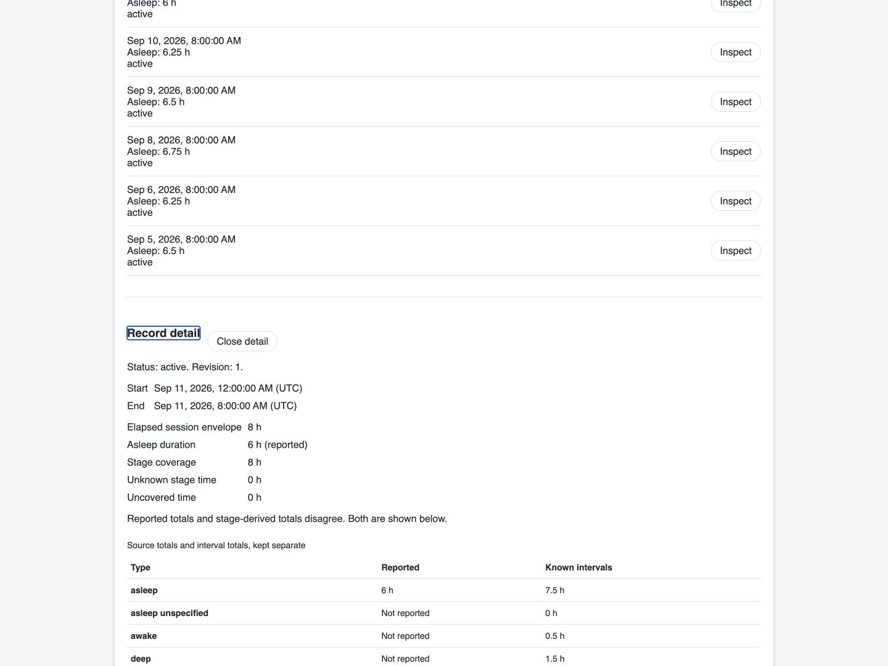
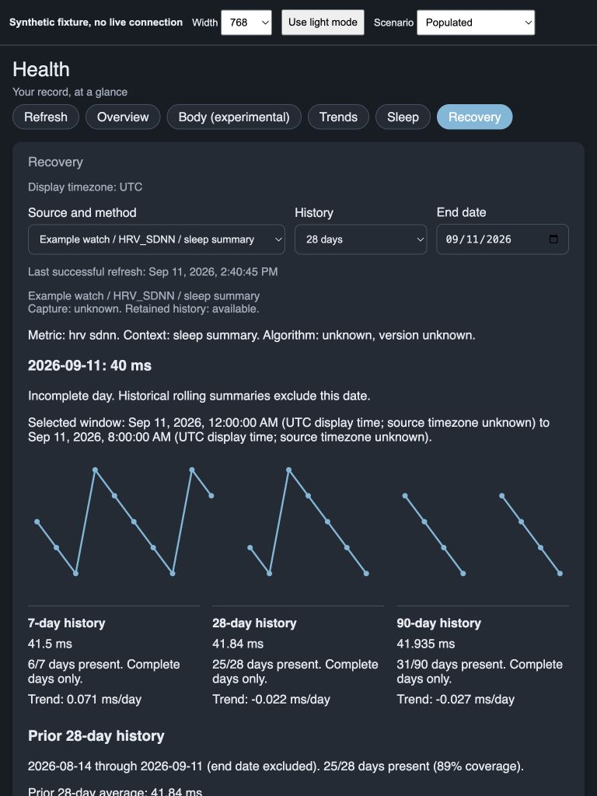
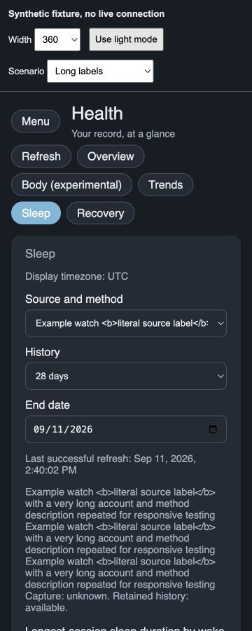

# Sleep and Recovery

These views are part of the unreleased 0.3 work. They show history already stored by a compatible provider or imported archive. Opening a view doesn't connect your phone, grant capture permission or create measurements. The current sensor mappings do not supply this history.

## Choose a source

Open **Sleep** or **Recovery** in the Health panel. A single source is selected automatically. If there are several, choose one before viewing a chart. Recovery separates the metric, context and algorithm version, including HRV SDNN and HRV RMSSD. Changing a display label does not change your saved selection.

Capture status and retained history are separate. A retired or revoked source can still have readable history. An unavailable saved source stays selected and empty until you choose another. Use **More sources** for additional catalog pages.

Choose 7, 28 or 90 days and an end date. Dates follow the timezone configured in Home Assistant. The panel says when it must fall back to UTC. Gaps in the chart mean there is no known value; they aren't zeros. Expand **Daily values and record choices** for the same dates and values in a table. Each row links to its selected record and the other records ending that day.

## Sleep

The chart shows the longest-session sleep duration for each wake date. It isn't total daily sleep. Naps and overlapping sessions stay in the underlying list, and the daily table gives the number of other records. General browsing lists sessions overlapping the range. A daily drill-down lists sessions ending on that display date, including across daylight saving changes.

Inspect a session to see its start, end, elapsed envelope, reported asleep duration and stage coverage. A known source timezone or reported offset appears beside each endpoint. Otherwise the detail states that it uses display time because the source timezone is unknown.

Reported totals and interval totals stay separate. When they disagree, the panel says so. The stage timeline uses the upper lane; in-bed context uses the lower lane. Awake, awake in bed and out of bed stay distinct. Unknown or uncovered time remains a gap. A session with a summary but no stages does not gain an invented timeline.

The complete timeline appears after all stage and context pages load. Detail shows partial loading until then. A correction during pagination discards the old intervals and reloads the record. The interval table provides the text alternative, 128 rows at a time, with display times and the original UTC timestamps. Use **Interval lane**, **Previous intervals** and **Next intervals** to inspect all retained intervals.

## Recovery

The daily value is the latest record ending on that date, not an average of same-day measurements. Its window, source, metric and context remain visible. Expand the daily table or inspect the underlying records to see alternatives.

Rolling summaries use complete days. The current day is marked incomplete. The prior 28-day baseline needs at least 14 days with values and shows its actual coverage. Average, difference and sample standard deviation come from the backend. The optional standardized difference is under **Technical detail**. Insufficient history, no current observation, constant history and unavailable calculations have separate explanations.

These values describe your history. They aren't readiness scores, clinical thresholds or advice. The panel does not combine methods or fill missing days.

## Exclusions and refresh

Administrators can open a record and choose **Exclude from summaries**. The record stays in local history and upstream data stays unchanged. Turn on **Show locally excluded records** to inspect it and choose **Restore to summaries**. An upstream deletion cannot be restored here. Other users can read the status without mutation controls.

A change uses the revision and hash shown by the loaded record. Charts update after the server confirms success. If the source changed first, the detail reloads and asks you to review it before choosing the action again. It does not automatically repeat the change against the newer record.

The panel refreshes every minute while attached, on manual refresh and after a confirmed local change. A connection or permission error preserves earlier values with a visible stale notice and their last successful refresh time. Reconnecting, changing views or selecting another source cannot apply an older response to the current view.

The controls work with a keyboard. Inspecting a record moves focus to its detail heading; closing returns focus to the initiating button. The interval table carries the meaning independently of stage colors. New views use the existing panel tokens and disable their motion when reduced motion is requested.

All screenshots on this page use generated example records. They are not captures of a person's health history or evidence of installed Home Assistant verification.
